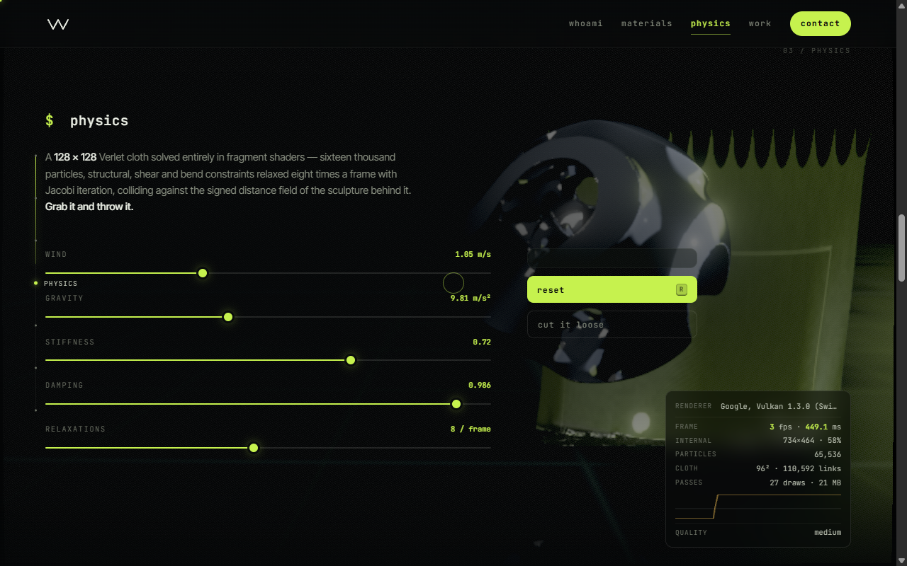

# winch — portfolio

A portfolio site that renders itself on the GPU. One WebGL2 context, about
four thousand lines of hand-written GLSL, and no dependencies at all — no
engine, no libraries, no asset files, no build step required to run it.

**[Open it →](https://winchxyz.github.io/)** · [@winchxyz](https://x.com/winchxyz) · [tryloupe.app](https://tryloupe.app)


---

## Running it

```bash
npm start
```

Then open <http://localhost:8141>. Any static server works — `npm start` just
runs the 40-line one in `server.js`, which exists because ES modules need an
http origin and `file://` will not load them.

Or skip all of that:

```bash
npm run build
```

That flattens the whole site into `dist/winch.html` — one file, 212 kB,
double-click it and it runs. Nothing is fetched at runtime except the two
Google Fonts, and it falls back to system fonts without them.

**Requirements:** a browser with WebGL2 and hardware acceleration — recent
Chrome, Edge, Firefox or Safari 15+.

---

## What is actually on screen

Everything moving is one `<canvas>`, drawn in seventeen passes per frame.

**A signed distance field, sphere-traced.** The sculpture has no geometry. It
is four mathematical forms — a noise-displaced sphere, a gyroid lattice, a
rounded box frame and a twisted torus — cross-faded as you scroll, and every
pixel of it walks the field until it hits the surface. It writes its own
`gl_FragDepth`, which is how the cloth and the particles can be occluded by a
shape that does not exist as triangles.

**Six materials, no textures.** GGX with height-correlated Smith visibility,
anisotropic GGX with a tangent frame built from a procedural direction field
(a distance field has no UVs), thin-film interference for the anodised
titanium, three-ray dispersion for the glass, a Charlie sheen lobe for the
cloth, and multi-scatter energy compensation so the rough metals are not
quietly too dark. The environment is an analytic function of the view
direction — a studio written down rather than photographed. There is no HDRI
and no BRDF lookup table.

**262 144 particles, solved on the GPU.** Position and velocity live in two
`RGBA32F` textures written by one fragment shader with two colour
attachments. They are advected by divergence-free curl noise, pulled onto the
zero level set of the sculpture, and then have the normal component of their
velocity removed so they flow *along* it rather than oscillating through it.
The renderer binds no vertex buffer: `gl_VertexID` indexes straight into the
state texture.

**A 128 × 128 Verlet cloth.** Sixteen thousand nodes, structural, shear and
bend constraints relaxed eight times a frame with Jacobi iteration, colliding
against the same distance field. Grab it and throw it.

**The post chain.** Temporal anti-aliasing with YCoCg neighbourhood clipping,
the Call of Duty bloom mip ladder with a Karis average on the first
downsample, an anamorphic streak, ACES, and a dither at exactly one 8-bit
step so the dark gradients do not band.

---

## Controls

| | |
|---|---|
| **1** – **6** | material preset |
| **drag** | orbit the sculpture — or, in the physics section, grab the cloth |
| **P** | photo mode — UI hidden, higher render scale |
| **Enter** | save a PNG |
| **G** | performance readout |
| **R** | reset the cloth |
| **M** | calm mode — halve the motion |
| **?** | the full list |

`?tier=low|medium|high|ultra` in the URL overrides the auto-detected quality.

---

## Layout

```
index.html          the whole page, statically
css/main.css        the "Signal" palette, same hex values as the profile README
js/
  main.js           boot, input, the loop
  renderer.js       every pass, in order
  director.js       what the scene does per section
  ui.js             the DOM half
  gl.js             a thin WebGL2 layer
  math.js           the linear algebra this actually uses
  content.js        everything the page says
  shaders/
    lib.js          shared GLSL — hash, noise, SDF, BRDF, colour
    raymarch.js     the hero pass
    particles.js    solver + attributeless renderer
    cloth.js        integrate, relax, render
    post.js         composite, TAA, bloom, streak, grade
tools/
  lint.mjs          static check on the assembled GLSL
  gputest.mjs       headless Chrome over CDP, no dependencies
  build.mjs         flatten to one file
```

---

## Verifying it without a GPU

The shaders are assembled from string chunks, so the compiler that would
catch a mistake lives on a graphics card. Two tools stand in for one:

```bash
npm run lint      # every program: undefined functions, chunk order, uniforms
npm run verify    # compile all 13 programs for real, in headless Chrome
```

`lint.mjs` catches the failure mode that concatenation invites — GLSL has no
forward declarations, so getting the chunk order wrong is a compile error you
only see on a machine with a working driver. It also cross-checks every
uniform the renderer sets against every uniform the shaders declare, in both
directions, because setting a uniform that does not exist is a silent no-op
by design.

`gputest.mjs` drives headless Chrome over the DevTools protocol using nothing
but the Node standard library, forces the SwiftShader software rasteriser,
and compiles and links all thirteen programs through the real ANGLE
translator. It can also load the site and screenshot it:

```bash
SITE='http://localhost:8141/?tier=medium' SECTION='#physics' node tools/gputest.mjs shot out.png
```

The images in `docs/` were captured that way. They are software-rendered at a
few frames a second, so they are honest about layout and lighting and
unfairly harsh about everything the temporal accumulation would have cleaned
up. On a real GPU it is sharper than this.

| | |
|---|---|
|  |  |
|  |  |

---

## The numbers

| | |
|---|---|
| Dependencies | 0 |
| Asset files | 0 |
| Build step to run it | none |
| Lines of GLSL | ~4 200 |
| Draw calls per frame | 17, or 27 with the cloth |
| Particles | 262 144 at ultra |
| Cloth nodes | 16 384, 196 608 constraint solves per frame |
| Render targets | ~90 MB at 1440p |

The page counts most of those live and shows you the real figures — see the
readout in the corner, and the `cat NUMBERS` section.

---

## Notes

The repository cards read their star counts from the public GitHub API once,
on load. If it is rate-limited, blocked or offline, nothing breaks: the
numbers baked into `js/content.js` are a verified snapshot and the badge next
to them says `snapshot` instead of `live`. Set `LIVE_STATS = false` at the top
of that file and the page never touches the network at all.

Quality is detected from core count, memory and the pointer type rather than
by sniffing the user agent, then adapts to the measured frame time with
hysteresis and a cooldown. It starts at half resolution deliberately: the
first frame is also the frame that pays for every shader's first real
execution, and on Windows a frame that takes more than about two seconds is
killed by the display driver's watchdog — which reads as "the tab crashed"
rather than "that was slow".

---

## Built in one prompt

> *"Create me a high-quality portfolio website On GPU. A website for me
> (x.com/winchxyz, github.com/winchxyz). I need it with 3D. Make it with
> maximum effort, show me best what you can create. Use all your power,
> knowledge and make best graphics and best design. Surprise me with graphics,
> materials, physics, textures and everything."*

Everything after that was refinement in the same session, with
[Claude Code](https://claude.com/claude-code).

---

MIT.
