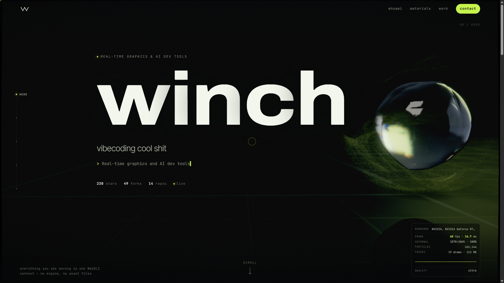
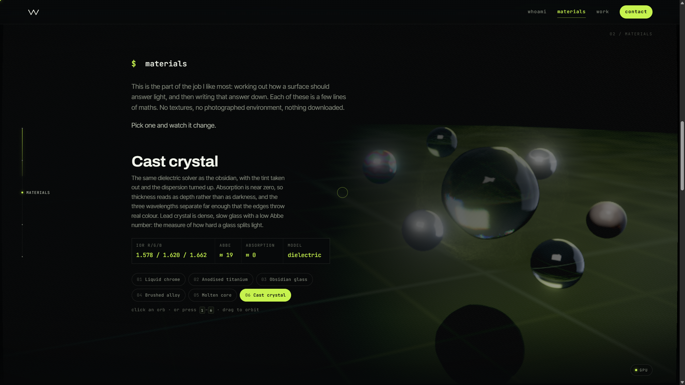
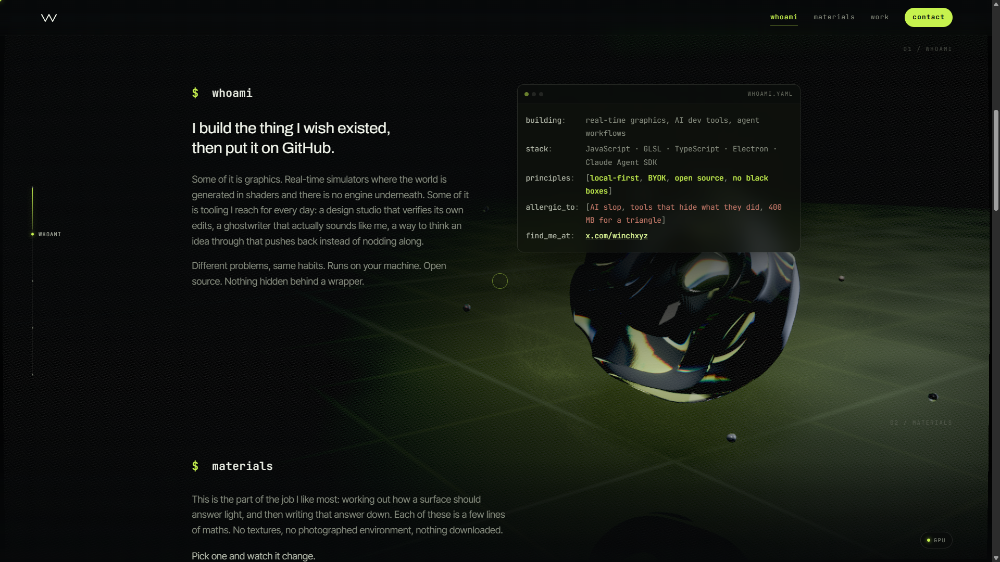
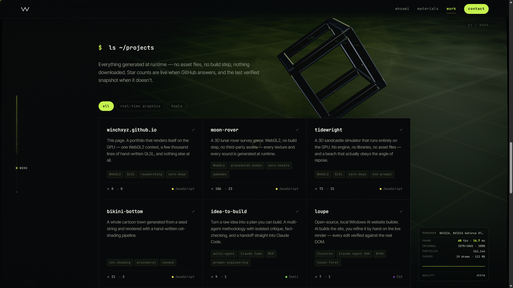
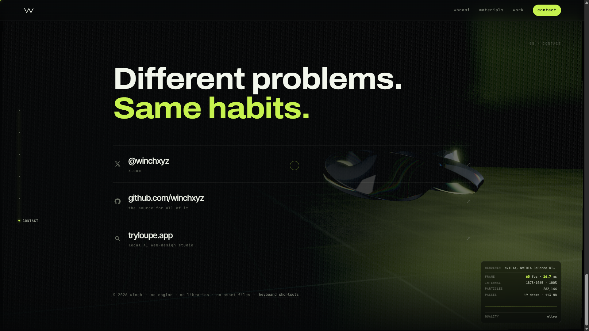
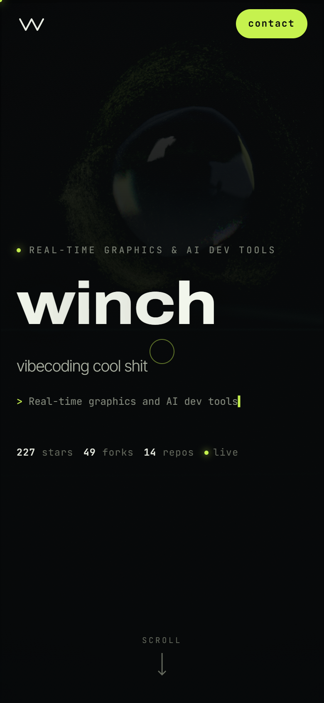

# winch · portfolio

A portfolio site that renders itself on the GPU. One WebGL2 context, a few
thousand lines of hand-written GLSL, and no dependencies at all. No engine, no
libraries, no asset files, no build step required to run it.

**[Open it →](https://winchxyz.github.io/)** · [@winchxyz](https://x.com/winchxyz) · [tryloupe.app](https://tryloupe.app)



---

## Running it

```bash
npm start
```

Then open <http://localhost:8141>. Any static server works; `npm start` just
runs the 40-line one in `server.js`, which exists because ES modules need an
http origin and `file://` will not load them.

Or skip all of that:

```bash
npm run build
```

That flattens the whole site into `dist/winch.html`: one file, 249 kB,
double-click it and it runs. Nothing is fetched at runtime except the two
Google Fonts, and it falls back to system fonts without them.

**Requirements:** a browser with WebGL2 and hardware acceleration. Recent
Chrome, Edge, Firefox or Safari 15+.

---

## What is actually on screen

Everything moving is one `<canvas>`, drawn in nineteen passes per frame.

**A signed distance field, sphere-traced.** The sculpture has no geometry. It
is four mathematical forms (a noise-displaced sphere, a gyroid lattice, a
rounded box frame and a twisted torus) cross-faded as you scroll, and every
pixel of it walks the field until it hits the surface. It writes its own
`gl_FragDepth`, which is how the particle cloud can be occluded by a shape
that does not exist as triangles.

**Six materials, no textures.** The page opens on the cast crystal, and the
materials section is the one place the page demonstrates rather than asserts.
GGX with height-correlated Smith visibility, anisotropic GGX with a tangent
frame built from a procedural direction field (a distance field has no UVs),
thin-film interference for the anodised titanium, three-ray dispersion for the
two glasses, and multi-scatter energy compensation so the rough metals are not
quietly too dark. The environment is an analytic function of the view
direction: a studio written down rather than photographed. There is no HDRI
and no BRDF lookup table.

**262 144 particles, solved on the GPU.** Position and velocity live in two
`RGBA32F` textures written by one fragment shader with two colour
attachments. They are advected by divergence-free curl noise, pulled onto the
zero level set of the sculpture, and then have the normal component of their
velocity removed so they flow *along* it rather than oscillating through it.
The renderer binds no vertex buffer: `gl_VertexID` indexes straight into the
state texture.

**The post chain.** Temporal anti-aliasing with YCoCg neighbourhood clipping,
the Call of Duty bloom mip ladder with a Karis average on the first
downsample, an anamorphic streak, ACES, and a dither at exactly one 8-bit step
so the dark gradients do not band.

---

## Controls

| | |
|---|---|
| **click an orb** | trade it for the one on the sculpture |
| **1** – **6** | the same, from the keyboard |
| **drag** | orbit the sculpture |
| **P** | photo mode, UI hidden, higher render scale |
| **Enter** | save a PNG |
| **G** | open the performance readout; **esc** or the chip closes it |
| **M** | calm mode, half the motion |
| **?** | the full list |

`?tier=low|medium|high|ultra` in the URL overrides the auto-detected quality.

Calm mode is the default for anyone whose system asks for reduced motion. The
DOM side of the page had listened to that setting for a while: reveals fire at
once, scrolling jumps rather than glides, the rotator stops rotating. The 3D
did not, which made the listening close to cosmetic, given that the thing
moving on this page is a full-screen sculpture with a quarter of a million
particles around it. **M** still toggles, so it is a default rather than a
decision taken away.

---

## Layout

```
index.html          the whole page, statically
css/main.css        the "Signal" palette, same hex values as the profile README
js/
  main.js           boot, input, the loop
  renderer.js       every pass, in order
  director.js       what the scene does per section
  ui.js             the DOM half
  gl.js             a thin WebGL2 layer
  math.js           the linear algebra this actually uses
  content.js        everything the page says
  shaders/
    lib.js          shared GLSL: hash, noise, SDF, BRDF, colour
    raymarch.js     the hero pass
    particles.js    solver + attributeless renderer
    post.js         composite, TAA, bloom, streak, grade
tools/
  lint.mjs          static check on the assembled GLSL
  audit.js          layout auditor, run inside the page
  gputest.mjs       headless Chrome over CDP, no dependencies
  build.mjs         flatten to one file
```

---

## Verifying it without a GPU

The shaders are assembled from string chunks, so the compiler that would catch
a mistake lives on a graphics card. Two tools stand in for one:

```bash
npm run lint      # every program: undefined functions, chunk order, uniforms
npm run verify    # compile all 10 programs for real, in headless Chrome
```

`lint.mjs` catches the failure mode that concatenation invites. GLSL has no
forward declarations, so getting the chunk order wrong is a compile error you
only see on a machine with a working driver. It also cross-checks every
uniform the renderer sets against every uniform the shaders declare, in both
directions, because setting a uniform that does not exist is a silent no-op by
design.

`gputest.mjs` drives headless Chrome over the DevTools protocol using nothing
but the Node standard library, forces the SwiftShader software rasteriser, and
compiles and links all ten programs through the real ANGLE translator. It can
also load the site and screenshot it:

```bash
SITE='http://localhost:8141' SECTION='#work' node tools/gputest.mjs shot out.png
```

`INJECT` runs a script before any of the page's own, which is the only moment
some things can be tested at all. The no-WebGL path is one: by the time
anything else could intervene the context exists and the decision is made.
Chrome's own flags for this were no help, either ignored or in conflict with
the ones the harness already passes, so the test stubs the context instead:

```bash
INJECT='HTMLCanvasElement.prototype.getContext = () => null' node tools/gputest.mjs shot out.png
```

That path is now checked rather than asserted. The notice appears with the
real reason, every reveal fires so the writing is readable, and the two pieces
of chrome that only make sense with a renderer behind them (the readout chip,
and a line beginning "everything you see moving") take themselves off the
page. `FLAGS` passes extra flags to Chrome for the cases where that is enough.

`MEDIA` sets media features, and it exists because headless Chrome reports
`prefers-reduced-motion: reduce` by default. Every capture ever taken through
this harness was therefore of the calm, reveal-instantly version of the page
rather than the one a visitor gets, which is a quiet way to test something
other than what ships. The images here are taken with
`MEDIA=prefers-reduced-motion=no-preference` now.

`GPU=1` runs the same harness on the real adapter instead, which is how the
sixty-eight-second shader compile described below was found:

```bash
GPU=1 node tools/gputest.mjs                    # per-program compile times
GPU=1 PAGE=bisect.html node tools/gputest.mjs   # which part of one costs what
```

Every image in this README is a real GPU capture taken through that harness,
at 1920×1080 and at 390×844, on an RTX 4070 at 60 fps. They are taken with
`?tier=ultra` in the URL, and that is not vanity: headless Chrome never gives
the quality controller the clean frame timings it wants, so it sits at the
opening tier forever and every capture came back dim, undersampled and full of
particle noise that is not in the real thing. An hour went into chasing a
rendering bug that turned out to be the harness photographing the fallback.

| | |
|---|---|
|  |  |
|  |  |



---

## The numbers

| | |
|---|---|
| Dependencies | 0 |
| Asset files | 0 |
| Build step to run it | none |
| Lines of GLSL | ~1 500 |
| Draw calls per frame | 19 |
| Particles | 262 144 at ultra |
| Render targets | ~113 MB at full scale |

The corner shows a small GPU chip and nothing else until you ask for more.
Click it, or press **G**, and it opens into the live readout. A performance
panel that is always on is a developer tool wearing a portfolio's clothes.

---

## What is not here

There was a physics section: a Verlet cloth you could grab and throw,
colliding against the same distance field. It was removed, and so was a
section of live render statistics. Both were interesting and neither was about
winch. A portfolio that spends two of its seven sections talking about the
portfolio has lost the plot. Five sections now: who, what he builds, how it is
built, the work, and how to reach him.

The cloth is in the history if it is ever wanted back. It cost three shader
programs, two float ping-pongs and nine draw calls a frame.

---

## Notes

The repository cards read their star counts from the public GitHub API once,
on load. If it is rate-limited, blocked or offline, nothing breaks: the
numbers baked into `js/content.js` are a verified snapshot and the badge next
to them says `snapshot` instead of `live`. Set `LIVE_STATS = false` at the top
of that file and the page never touches the network at all.

### The material palette

The materials section used to be a list of names beside a swatch. It is a ring
of orbs around the sculpture now, each one wearing its own material, and
clicking one starts an exchange: it comes in, and the material the sculpture
was wearing leaves for the slot the arriving one vacated.

That adds up because a slot is empty exactly while its material is on the
sculpture. One orb leaves the ring, one returns, the count never changes, and
the gap in the ring is always the thing you are currently looking at.

Three things make it cheap enough to be worth doing:

**The orbs are intersected, not marched.** They are spheres, so a ray meets
one by solving a quadratic. A handful of those, once per pixel, instead of a
handful more distance-field evaluations at every one of a hundred-odd march
steps.

**Their positions come from the CPU**, as a uniform array, rather than being
recomputed in the shader. The click test and the pixels then cannot disagree
about where an orb is, which they will eventually, if the same orbit is
written down twice.

**They are lit, not shaded.** No shadow march, no ambient occlusion, no second
bounce, and a single refraction for the dielectrics instead of an interior
march per wavelength. Everything cut would be invisible at forty pixels
across, and each one would otherwise have cost about what the sculpture does.
They do get a stop and a half more light than the sculpture: a mirror in a
dark room is a dark ball, which is correct and useless as a swatch.

The flight is the one moment an orb stops being a sphere. From the instant it
leaves the ring it is folded into the sculpture's own field through a
polynomial smooth minimum, so the two surfaces grow a neck toward each other
and close it, the way two drops of mercury do.

The blend radius is the whole trick, and it is also the whole bug. The first
version of this stepped it from 0.03 to 0.56 on the frame of impact: the
orb was a separate body, and then, one frame later, it had a wide neck. That
reads as a collision, not a coalescence. It now follows a curve with no corner
anywhere in it, and the approach decelerates to a stop as the surfaces meet
rather than cutting from one curve to another mid-flight, so no frame of the
arrival contains a step.

Two materials, without a second material in the shader. The arriving orb keeps
being drawn as an orb, in its own material, riding one and a half per cent
proud of the blob it hands over to; the neck reaching for it belongs to the
sculpture and wears the old material. So the ball is the material coming and
the neck is the material going, and it costs nothing, because the sculpture
adopts the new material on the same frame the drawn orb disappears into it.
Nothing changes colour; something changes owner.

The departure is the same trick run backwards, and its break is found rather
than scheduled. A smooth minimum bridges a gap only while its blend radius is
wider than the gap. Push a head out of the body and let the blend fall away
faster than the gap opens, and the frame where the inequality flips is the
frame the thread gives. Testing for that is three terms of arithmetic and it
lands on the break at any scale; the hand-picked constant it replaced only
managed it at one.

The hard edit underneath is still hard, and it is still true that material
properties cannot be meaningfully interpolated: halfway between chrome and
glass is not a material. What changed is where the edit gets made. It used to
be made in time, on a single frame, under a flash. It is made in space now.

For as long as an exchange lasts the body is two materials at once, divided by
a region that contracts onto the drop carrying the old one away. At contact
that region covers the whole body, so nothing appears to happen; as it shrinks
the new material floods in from where its own drop landed; the last of the old
material is the drop that leaves. Taking one in is visibly what puts the other
out, rather than a caption claiming it did.

It cost 78 ms of shader compile, and that is the interesting part. `describe()`
already branched on a material id handed in at draw time rather than a constant
the compiler could fold away, so every material's code was in the program
either way. Asking the question per point instead of per frame compiles to
almost the same thing: the shader had been able to paint one surface in two
materials since the day it was written, and nobody had ever asked it to.

Two things had to be exempted, and both were bugs standing ready. The arriving
drop keeps its own material for as long as it is in the field, or it gets
repainted with the material of the body it is flying towards.

That one shipped broken, and it is worth saying why, because the mistake is
easy to make twice. The exemption was written as an exemption from the drain,
so it only applied once the drain existed, which is once the body has switched.
The drop enters the field two thirds of a second before that. For all of that
time it was inside a body still wearing the old material, matched the general
case, and came out the old colour: the ball visibly turned into the thing it
had been clicked to replace, and only then did something else leave. The
correct statement is not "exempt from the drain" but "the arriving drop is its
own material", and those coincide everywhere except the stretch that mattered.

A CPU replay of the shader's own decision reported the drop as belonging to
`matCurrent()` and I read that as correct, because during the approach
`matCurrent()` is the OLD material and the label in my own dump said "new".
The screenshot said otherwise within a second of looking at it. And the dielectric branch had to stop reading `uTrans`, `uIor`,
`uDispersion` and `uAbsorb` from the uniforms: those are the same numbers as
the point's own material whenever the body is one material, and emphatically
not when it is two. Reading `uTrans` there would have run the glass path over
the half that is no longer glass.

The emissive burst that used to cover the switch is a third of what it was. It
existed to hide an instant edit, there is no longer an instant edit to hide,
and a flash bright enough to cover the change was covering the only thing
worth watching.

### Everyone starts at the lowest tier

Detection gives a *ceiling*, not a starting point. Guessing a quality tier
from core count and a renderer string and then opening at it means the very
first frame, the one that also pays for every shader's first execution and
every pipeline object the driver builds, is the heaviest frame the machine
will ever draw. Getting that guess wrong on unfamiliar hardware is exactly
what makes a tab stop responding.

So every visitor starts at the smallest tier, and the controller promotes one
step at a time only after two full seconds of headroom at full scale. A fast
machine reaches `ultra` within a few seconds; a slow one simply never does,
and never sees a frame it could not afford. A load that starts and never
finishes lowers the ceiling on the next visit.

Headroom is measured as **dropped frames, not milliseconds**. Rendering is
locked to the display, so the frame delta sits at the refresh interval,
16.7 ms on a 60 Hz panel, whether the GPU finished in two milliseconds or in
sixteen. The first version of this controller tested `msAvg < 11.5` and would
therefore have sat at the lowest tier forever, on every machine. What vsync
does reveal is missed frames: take the fastest frame observed as the refresh
interval and count how often the delta runs long.

### A layout auditor, because screenshots only catch what you look at

`tools/audit.js` runs inside the page and measures the three things that
actually go wrong in a layout: content wider than the box holding it, anything
reaching past the viewport edge, and two pieces of text sitting on top of each
other. The harness loads it over http and sweeps every section:

```bash
GPU=1 VIEW=390x844 MOBILE=1 PROBE='(async()=>JSON.stringify(await import("/tools/audit.js").then(m=>m.sweep())))()' node tools/gputest.mjs shot out.png
```

It found a stats grid overflowing its cells by up to 50px at 1366. A figure
like `1,572,864` set at 42px is about 200px wide and the cell's content box
was 144px. No screenshot had shown it, because the digits simply ran under the
neighbouring cell and looked plausible.

One thing it has to get right to be useful: overlap is measured per **line
box**, not per element. `getBoundingClientRect()` on an inline span that wraps
returns the union of its line boxes, a rectangle covering everything between
the two lines including its neighbours' text, so comparing those unions
reports every wrapped inline as fully overlapping its siblings.
`getClientRects()` gives the real boxes.

Currently clean at 2560×1440, 1920×1080, 1366×768, 768×1024, 430×932, 390×844
and 360×740, with no tap target under 24px on any of the phone sizes.

### What a phone was actually getting

Auditing the layout on a phone is not the same as using one, and the
difference turned out to be most of the experience.

Every scroll swung the camera. A vertical drag is how you scroll a page, and
the same handler was reading it as a drag to orbit: one ordinary swipe drove
the pitch to 0.697 against a limit of 0.7, so reading this page on a phone
threw the scene to its extreme tilt and let it drift back, over and over. The
gesture's axis is decided once now, on the first movement worth calling a
direction, and held: vertical belongs to the page, horizontal orbits. Touch
sensitivity came down with it, because a thumb travels much further than a
mouse for the same intent.

There was no navigation. The rail is `display:none` on a phone and so were all
three section links, which left the bar holding one contact button and nothing
else: five sections reachable only by scrolling past everything in front of
them. They fit, as it turns out. At 11px the row measures 270px inside 390 and
clears the wordmark by twenty, and the tap target is built out of padding
rather than font size, so the letters stay where the design wants them and the
target is 44px tall.

And there was a button that did nothing. The readout panel is hidden below
760px, being 262 pixels of developer telemetry with a graph in it. The chip
that opens it was not hidden, so tapping it toggled a class and produced no
visible result, while sitting in the corner over whatever the page had put
there and eating the tap meant for a material.

The camera integration was also frame-rate dependent, which this codebase
elsewhere goes to some trouble to avoid: `o.yaw += o.vy` with no `dt` in it
turns the view two and a half times further on a 144 Hz panel than on a 60 for
the same drag.

### The harness was timing its own leftovers

`chrome.kill()` reaches the process Node spawned and nothing else. Chrome's
renderer, GPU and utility processes are its children, and they survive a
signal sent to the parent. Nothing in the harness noticed, because every run
still produced a plausible number.

Five consecutive measurements of the same unchanged shader:

| run | compile |
|---|---|
| 1 | 5.8 s |
| 2 | 15.1 s |
| 3 | 16.2 s |
| 4 | 16.3 s |
| 5 | 18.2 s |

The shader had not changed between the first measurement and the last. The
machine had. A monotonic climb across repeated runs of identical work is never
the work getting slower.

The harness was leaving its browser behind. `chrome.kill()` signals the
process Node spawned, and the launcher it spawns exits almost immediately
after handing off, so the renderer and GPU processes are reparented and
outlive both it and any `taskkill /T` aimed at its pid. Matching instead on
the throwaway profile directory, which every process in that browser carries
on its command line, kills this run and provably nothing else. It now leaves
zero processes behind, measured over three consecutive runs, and the same five
timings read 9.0 s cold, then 5.8, 5.8, 5.9 and 5.8.

One caveat worth recording, because the alternative is a tidier story than the
evidence supports: the clean-up fix and a blanket kill of every Chrome on the
machine happened in the same step, so the stable numbers cannot be attributed
to the fix alone. What is established is that the harness used to leave its
browser running and now does not, and that a measurement which quietly
degrades across runs is worth catching either way.

This is the same failure as `msAvg < 11.5` above. A measurement that always
returns something plausible is worse than one that throws, because nothing
ever prompts you to check it.

### Composition is specified on the screen, not in the world

Each section used to name a camera position in world units. That framing is
only correct at the one aspect ratio it was tuned at. The type sits in a
centred, max-width column, so as the viewport widens the column stays put
while a world-space offset keeps sliding the sculpture outward until it runs
off the edge. Which it did, at 16:9.

A keyframe now says where the subject should appear *on screen* and how much
of the frame it should fill, and the camera is solved from that every frame
against the current aspect ratio:

```
d      = max( R / (fill · tan(fov/2)),  R / (fillW · aspect · tan(fov/2)) )
camPos = pivot + dir·d + right·(−ndcX · d · aspect · tan(fov/2))
                       + up   ·(−ndcY · d · tan(fov/2))
```

The horizontal position is a fraction of the **content column** rather than of
the viewport, so the sculpture tracks the type instead of the window. Portrait
gets its own composition, top centre using the full width, because on a phone
there is no empty column to the right to put anything in.

### Why the distance field reads its noise from a texture

The first version computed value noise analytically: eight hash calls and a
quintic interpolant, about a hundred instructions. That is nothing at runtime,
and it was catastrophic anyway, because the noise lives inside the distance
field, the distance field is inlined at every march step and at every normal
and occlusion tap, and the compiler expands every copy of it.

The raymarch program took **sixty-eight seconds to compile** on an RTX 4070.
The entire rest of the pipeline compiled in 1.6 seconds combined. During those
sixty-eight seconds the main thread is blocked, which the browser reports as
an unresponsive page. The site was effectively unopenable, and no amount of
reloading helped.

Bisecting it by stubbing one function at a time (`tools/bisect.html`):

| | compile |
|---|---|
| baseline | 64.9 s |
| stub `noised()` | 15.3 s |
| stub `sculpture()` | **5.2 s** |

So it was never the arithmetic. It was inlining. Reading the noise from a 64³
texture instead, where hardware trilinear filtering *is* the interpolation,
took the program to **4.7 s**. Linking through
`KHR_parallel_shader_compile` and collecting the result from a
`requestAnimationFrame` loop took the freeze to zero: the driver compiles on
its own threads while the boot bar keeps moving.

Boot went from 133 seconds to about ten, and it holds 60 fps after.

The lesson generalises: in a shader, the cost of a function is not what it
costs to run. It is what it costs to run, multiplied by every place the
compiler decides to paste it.

---

## Built in one prompt

> *"Create me a high-quality portfolio website On GPU. A website for me
> (x.com/winchxyz, github.com/winchxyz). I need it with 3D. Make it with
> maximum effort, show me best what you can create. Use all your power,
> knowledge and make best graphics and best design. Surprise me with graphics,
> materials, physics, textures and everything."*

Everything after that was refinement in the same session, with [Claude
Code](https://claude.com/claude-code).

---

### Notes on the interaction

Text selection is disabled across the page. A drag here means orbit the
sculpture, and a drag that also paints a selection across the headline reads
as a bug. The cost is that nothing can be copied, shell commands included;
`user-select:text` has to be put back on anything that should be exempt.

---

MIT.
